# Dual Stack Deployment on AWS: EC2 (Backend) + S3 (Frontend)

This guide explains how to deploy a simple full-stack application where:

- 🖥️ **Frontend** (HTML/CSS/JS) is hosted on AWS S3  
- ⚙️ **Backend** (Node.js/Express) is hosted on AWS EC2  

---

## 🧰 Prerequisites

- AWS Account  
- Basic CLI skills  
- A Working Node.js + Basic Frontend project 

---

## 🖥️ Step 1: Launch EC2 Instance for Backend

1. Go to the **EC2 Dashboard** → Click **Launch Instance**  
2. Choose **Ubuntu Server 20.04 LTS**  
3. Select **t2.micro** for free tier  
    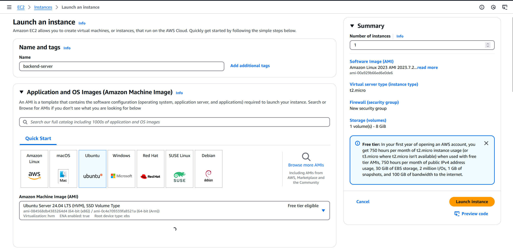

4. Add **Inbound Security Rules**:  
   - SSH (22)  
   - Custom TCP (3000)
    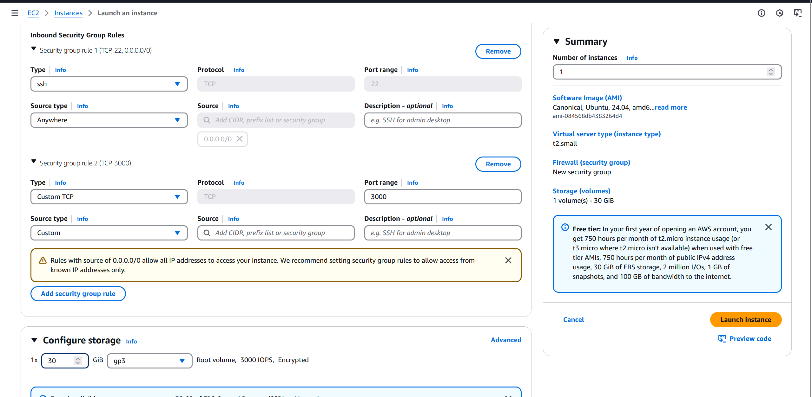

 5. **EC2** successfully launched
    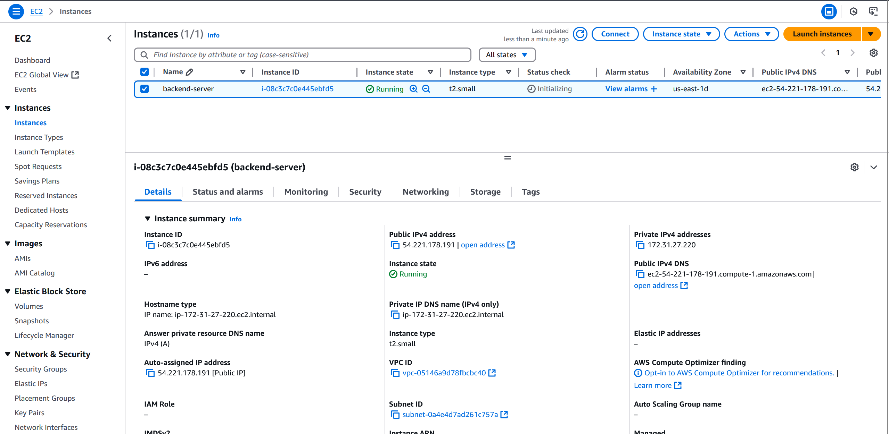

---

## 🔌 Step 2: SSH into EC2 and Setup Backend

```bash
ssh -i your-key.pem ubuntu@<your-ec2-ip>
```


1. Clone your project repo:

```bash
git clone <your-repo-url>
```
  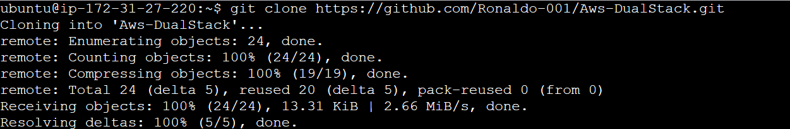

2. Navigate into your project and backend directory:

```bash
cd Aws-DualStack
cd backend
```

3. Install dependencies and start the app:

```bash
npm install
npm start
```

  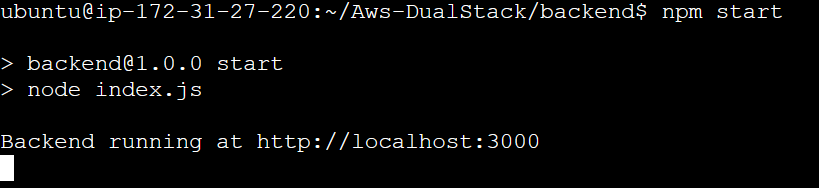

4. Confirm that your backend API is running (usually on `http://<EC2-IP>:3000/quote`)

  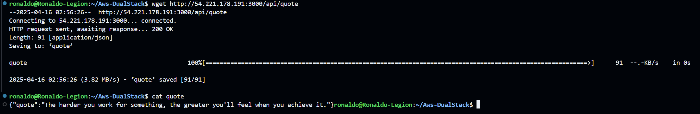

---

## 🌐 Step 3: Configure the Frontend

1. Your frontend code should be in `Aws-DualStack/frontend/`  
2. In `script.js`, update the `fetch` URL to point to your **EC2 Public IP and backend port (3000)**  

  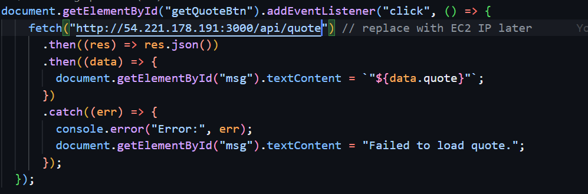

---

## 🗂️ Step 4: Upload Frontend to AWS S3

1. Go to **S3** in AWS Console → Create a new bucket  

   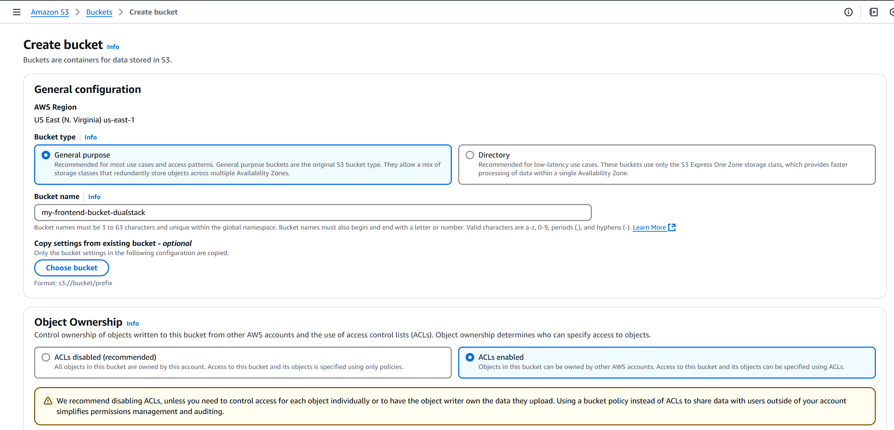
   
3. Uncheck **Block All Public Access**

   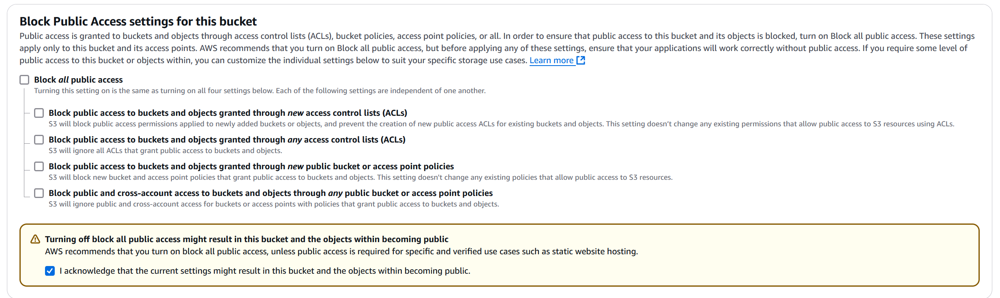

3. Upload files from `frontend/` (e.g., `index.html`, `style.css`, `script.js`)  

    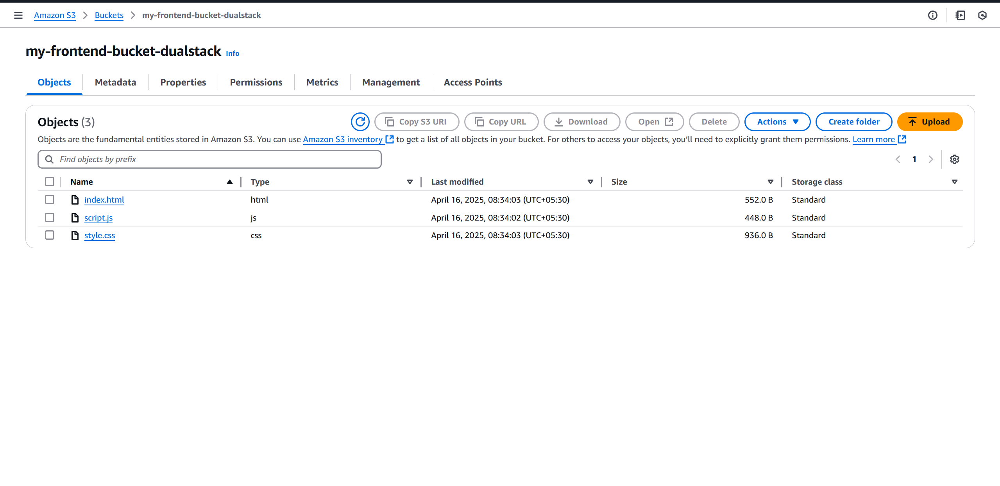
     
4. Enable **Static Website Hosting**

    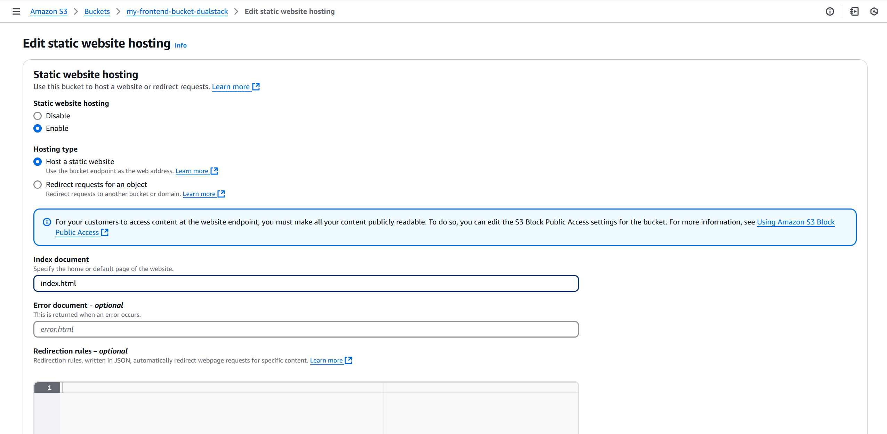

5. Apply the **Bucket Policy** for public access:
```bash
{
"Version": "2012-10-17",
"Statement": [
{
"Sid": "PublicReadGetObject",
"Effect": "Allow",
"Principal": "",
"Action": "s3:GetObject",
"Resource": "arn:aws:s3:::your-bucket-name/"
}
]
}
```
   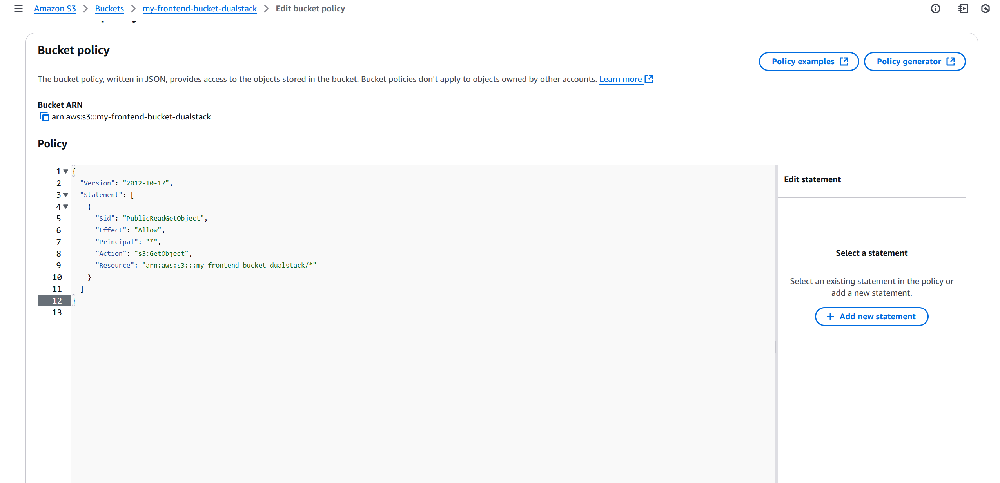

---

## 🌎 Step 5: Open Your Frontend

- Copy the **Bucket website endpoint** from S3 and open it in your browser  

  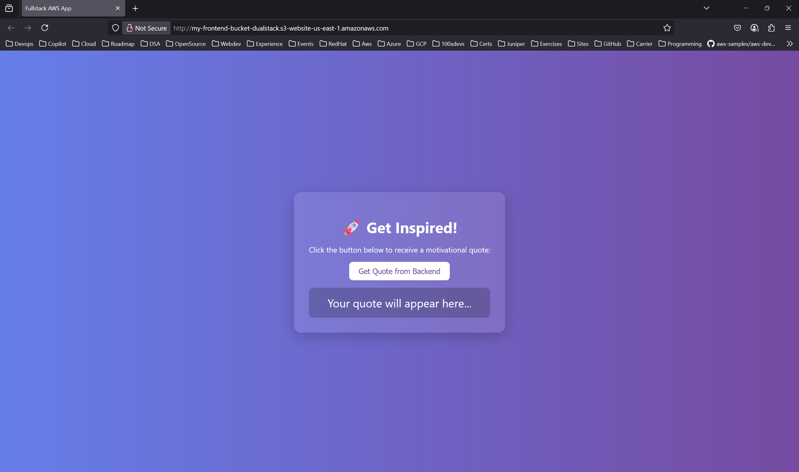

You should now see your HTML site load in the browser.

---

## 🔁 Step 6: Connect Frontend to Backend

- Click the **"Get Quote"** button (or any action using JS)  
- This should fetch a quote from the backend API running on your EC2  

  

---

## ✅ Final Result

🎉 Your frontend is hosted publicly on AWS S3, and it communicates with a backend Node.js app running on AWS EC2!

---

## 🔒 Note on Security (Optional Future Step)

- We can use **AWS API Gateway** in front of your EC2 app for better security, rate limiting, and API key usage.

---

> 💬 Feel free to reach out for improvements or enhancements to this deployment guide!
